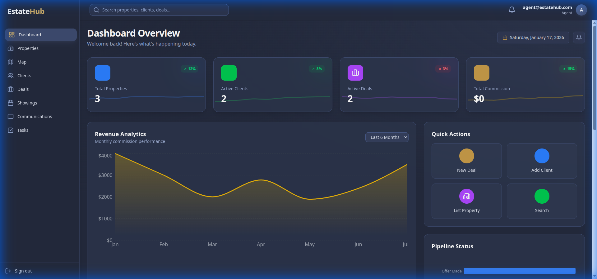
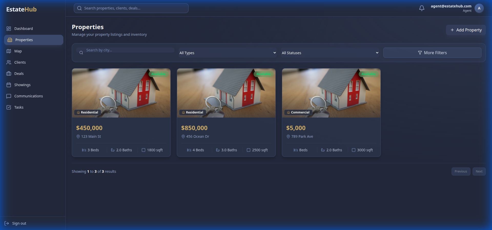
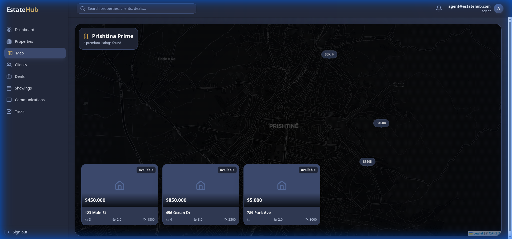
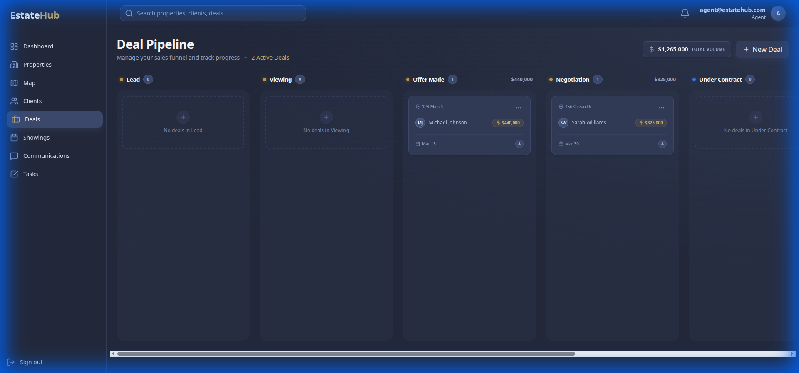
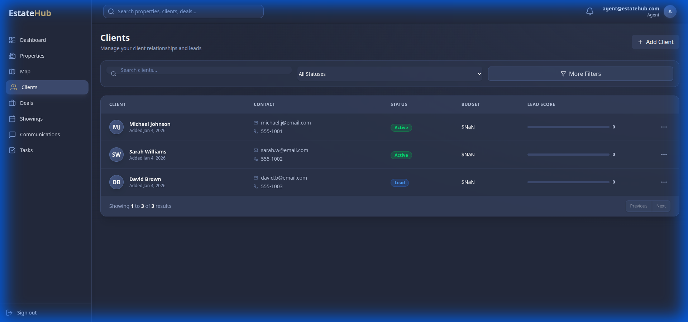
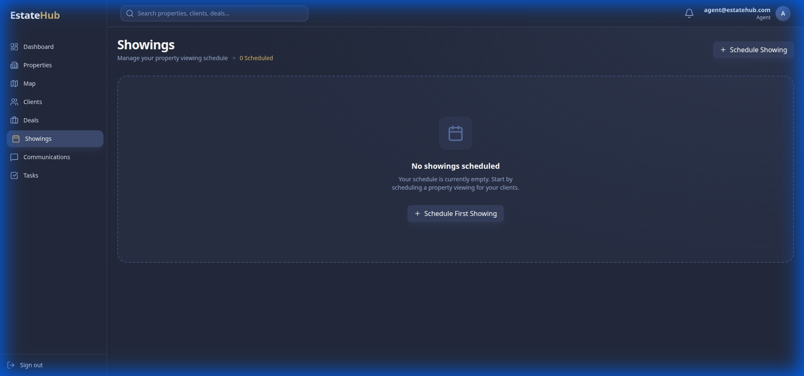
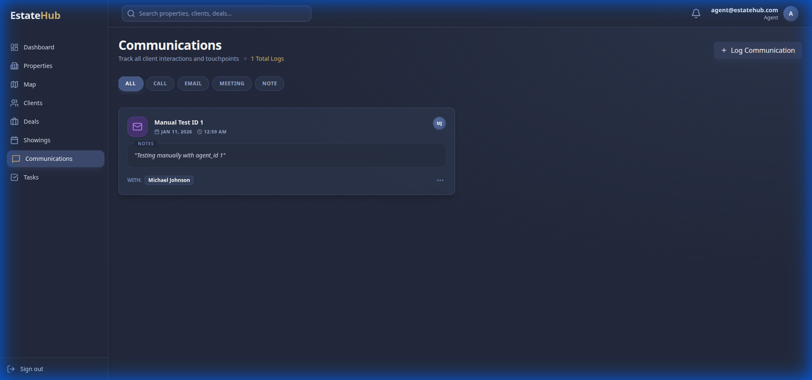
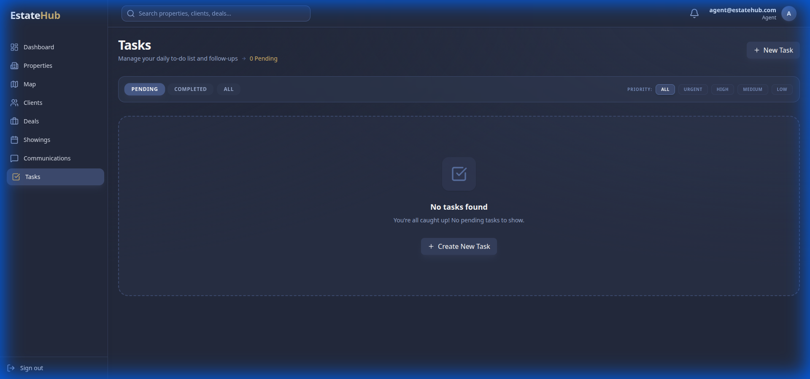

# 🏠 EstateHub

EstateHub is a modern, full-stack Real Estate CRM designed for agents to manage their properties, clients, deals, and daily tasks with ease. It features a sleek "Midnight Dark Theme" with glassmorphism and a highly responsive dashboard.

## 📱 Preview



<p align="center">
  
  
</p>

<p align="center">
  
  
</p>

<p align="center">
  
  
</p>

<p align="center">
  
</p>

## ✨ Features

- **📊 Dynamic Dashboard**: Real-time stats on active deals, scheduled showings, and upcoming tasks.
- **🏠 Property Management**: View, filter, and manage property listings with image support and map integration.
- **👥 Client CRM**: Keep track of clients, their preferences, and communication history.
- **🤝 Deal Pipeline**: Manage the entire lifecycle of real estate transactions from lead to closing.
- **📅 Showing Scheduler**: Organize and track property viewings.
- **💬 Communications Log**: Log all interactions with clients (emails, calls, meetings).
- **✅ Task Management**: stay on top of daily to-dos with a dedicated task board.
- **🗺️ Map View**: Interactive map showing property locations using Leaflet.

## 🛠️ Tech Stack

### Frontend
- **React 19** with Vite
- **Tailwind CSS 4** for styling
- **Zustand** for state management
- **React Router 7** for navigation
- **Lucide React** for icons
- **Leaflet & React Leaflet** for maps
- **Recharts** for data visualization
- **Axios** for API requests

### Backend
- **Node.js & Express 5**
- **PostgreSQL** database with `pg` pool
- **JWT** for authentication
- **Bcrypt** for password hashing
- **Multer** for image uploads
- **Nodemailer** for email notifications (optional)

## 🚀 Getting Started

### Prerequisites
- Node.js (v18+)
- PostgreSQL installed and running
- npm or yarn

### Installation

1. **Clone the repository**
   ```bash
   git clone <repository-url>
   cd EstateHub-
   ```

2. **Setup the Backend**
   ```bash
   cd server
   npm install
   ```
   - Create a `.env` file in the `server` directory based on the provided configuration:
   ```env
   PORT=5000
   DB_USER=your_postgres_user
   DB_PASSWORD=your_postgres_password
   DB_NAME=estatehub
   DB_HOST=localhost
   DB_PORT=5432
   JWT_SECRET=your_jwt_secret
   ```
   - Initialize the database schema (ensure your PostgreSQL service is running).

3. **Setup the Frontend**
   ```bash
   cd ../estate
   npm install
   ```

### Running the Application

1. **Start the Backend Server**
   ```bash
   cd server
   npm run dev
   ```

2. **Start the Frontend Development Server**
   ```bash
   cd estate
   npm run dev
   ```
   The application will be available at `http://localhost:5173`.

## 📁 Project Structure

```text
EstateHub/
├── estate/             # Frontend application (React + Vite)
│   ├── src/
│   │   ├── components/ # Reusable UI components
│   │   ├── pages/      # Page-level components
│   │   ├── layouts/    # Page layouts
│   │   ├── store/      # Zustand state stores
│   │   └── utils/      # Helper functions
│   └── ...
├── server/             # Backend API (Node.js + Express)
│   ├── config/         # Database and app config
│   ├── controllers/    # Route controllers
│   ├── middleware/     # Auth and error middleware
│   ├── routes/         # API route definitions
│   ├── utils/          # Backend utilities
│   └── ...
└── README.md
```

## 📝 License
This project is licensed under the ISC License.
